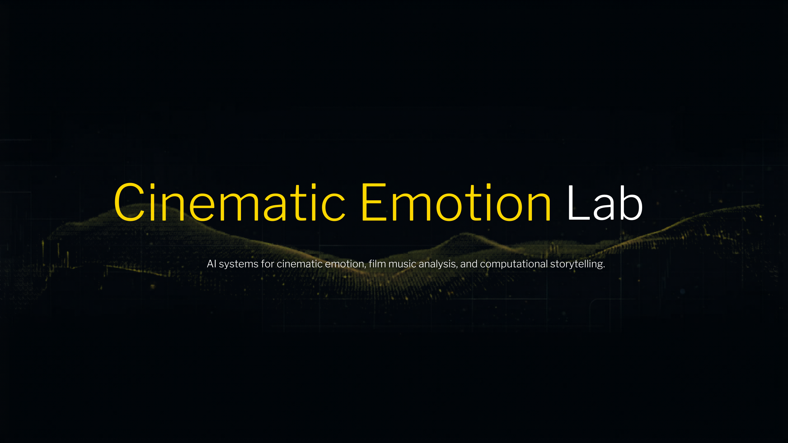
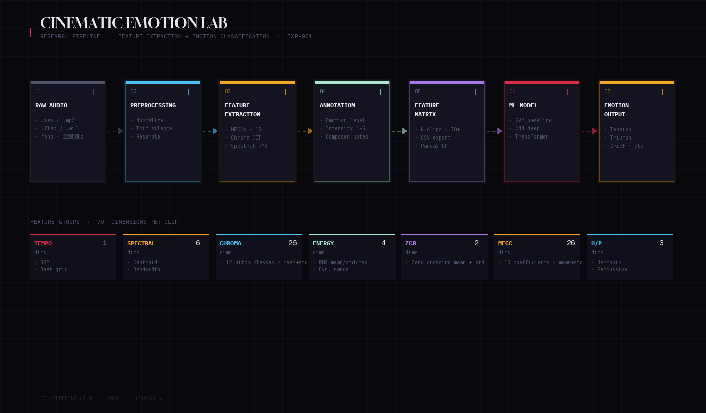
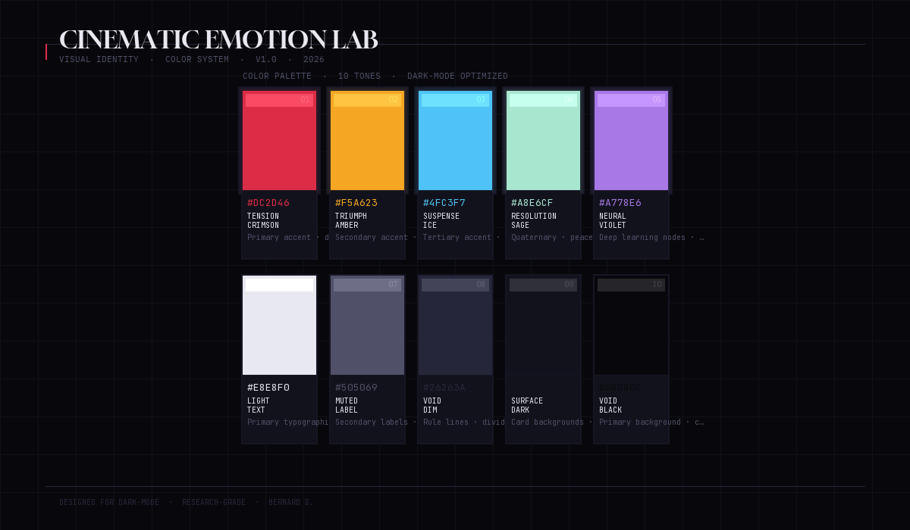

# Cinematic Emotion Lab

> *Can a machine learn to feel what a film score is doing?*

**Cinematic Emotion Lab** is an independent AI research initiative investigating the computational architecture of emotional perception in cinematic music. It sits at the intersection of film composition, music information retrieval, cognitive neuroscience, machine learning, and narrative theory — treating the film score not as aesthetic artifact, but as a **precision emotional transmission system** worthy of rigorous scientific study.

This repository documents an active, ongoing research program. Findings are released in stages. The full theoretical framework, trained models, and dataset will be disclosed through publication channels.

---

## Research Components

| Component | Domain | Status |
|-----------|--------|--------|
| **Acoustic Feature Extraction** | Music Information Retrieval | Active · EXP-001 |
| **Emotion Annotation Framework** | Human-Computer Interaction | In Development |
| **Cinematic Dataset Construction** | Data Engineering | Ongoing |
| **Harmonic Tension Modeling** | Computational Musicology | Experimental |
| **Narrative Emotion Arc Mapping** | Computational Storytelling | Theoretical |
| **Composer Interpretation System** | Human Annotation | In Progress |
| **ML Emotion Classifier** | Supervised Learning | Baseline Stage |
| **Spectral Suspense Detection** | Audio Signal Processing | Experimental |
| **Tempo–Arousal Correlation Study** | Affective Computing | Data Collection |
| **Architecture-Inspired Spatial Analysis** | Spatial Design × Music | Conceptual |

---

## Experimental Systems

### EXP-001 · Acoustic Feature Extraction Pipeline
The foundational extraction system. Processes raw cinematic audio through a multi-dimensional feature space comprising timbral, harmonic, rhythmic, and dynamic descriptors. Outputs a structured feature matrix suitable for downstream classification and correlation studies.

**Feature dimensions extracted per clip:** 70+
**Libraries:** `librosa` · `scipy` · `numpy` · `pandas`
**Status:** Active — baseline extraction complete

---

### EXP-002 · Emotion Classification Baseline *(upcoming)*
Supervised classification of cinematic emotion categories using extracted acoustic features. Establishes a baseline accuracy benchmark against which deep learning approaches will be evaluated.

**Planned models:** SVM · Random Forest · Gradient Boosting
**Status:** Pending annotation completion

---

### EXP-003 · Harmonic Tension Sequence Modeling *(planned)*
A sequential model trained to predict moment-to-moment harmonic tension from chroma and spectral features. Designed to capture the *trajectory* of emotion rather than static classification.

**Approach:** LSTM / Transformer over temporal feature sequences
**Status:** Architecture design phase

---

### EXP-004 · Composer vs. Model Interpretation Study *(planned)*
A controlled comparison between composer-annotated emotional profiles and model-predicted outputs for the same audio clips. Designed to expose the systematic gaps between human musical intelligence and machine perception.

**Status:** Annotation framework in development — results embargoed pending publication

---

## Methodology Overview

The Cinematic Emotion Lab operates from a core methodological premise: **emotional experience in cinematic music is not subjective noise — it is structured signal.** The lab applies rigorous signal processing, feature engineering, and machine learning methodology to test this premise across multiple experimental axes.

### Signal Chain

```
Raw Cinematic Audio
        ↓
  Preprocessing Layer
  (normalization · silence trim · mono conversion · resampling)
        ↓
  Feature Extraction Engine
  (MFCCs · Chroma · Spectral · RMS · ZCR · H/P Separation)
        ↓
  Annotation Layer
  (composer labels · emotional intensity · narrative position)
        ↓
  Feature Matrix  [N clips × 70+ dimensions]
        ↓
  ML Modeling Layer
  (classification · regression · sequence modeling)
        ↓
  Evaluation + Composer Comparison
        ↓
  Publication
```

### Analytical Domains

**Acoustic Analysis** — Low-level signal features extracted at frame resolution, aggregated to clip-level statistical descriptors. Feature selection guided by musicological theory, not purely statistical variance.

**Harmonic Analysis** — Chroma-based pitch-class profiling combined with tonal tension metrics. Captures mode, key stability, and harmonic motion as emotional encoding mechanisms.

**Temporal Dynamics** — Tempo tracking, beat grid analysis, and RMS envelope modeling. Treats rhythmic density as an arousal proxy, validated against composer annotations.

**Structural Decomposition** — Harmonic/percussive source separation used to model orchestral texture balance. Theorized as a correlate of emotional valence in cinematic contexts.

For methodology details see [docs/METHODOLOGY.md](docs/METHODOLOGY.md).

---

## Current Research Directions

### I · The Emotional Precision Hypothesis
*Does cinematic music encode emotional states with the same structural regularity as linguistic syntax?*

Preliminary feature analysis suggests consistent acoustic signatures across clips annotated with the same emotional category — even across composers and stylistic periods. Quantification of this consistency is underway.

### II · The Harmonic Tension Arc
*Can a model learn the shape of tension — not just its presence?*

Working hypothesis: harmonic tension in film music follows measurable trajectory patterns that align with narrative structure. A sequence modeling approach is being developed to test whether these arcs are learnable and genre-transferable.

### III · The Composer Gap
*Where does the machine fail to hear what the composer intended?*

The most intellectually rich research direction. Initial annotation work suggests systematic divergences between acoustic feature profiles and composer-reported emotional intent. Characterizing this gap is the central long-term research problem.

### IV · Spatial Emotion Modeling
*Can architectural theories of space inform how we model musical emotional space?*

An interdisciplinary speculative research thread drawing from spatial design theory, acoustic ecology, and embodied cognition. Explores whether musical emotional space has geometric properties analogous to physical space.

---

## Architecture Pipeline



The research pipeline is designed for **staged refinement** — each layer is independently operable while feeding forward into the next. This modularity allows experimental components to be swapped, upgraded, or replaced without collapsing the broader system.

The pipeline operates across four abstraction layers:

**Layer 1 — Signal** · Raw audio ingestion, format normalization, mono conversion, sample rate standardization. All clips processed to 22050Hz, float32.

**Layer 2 — Features** · Multi-domain acoustic feature extraction. 70+ dimensions per clip. Designed to be over-complete at this stage; dimensionality reduction applied downstream.

**Layer 3 — Annotation** · Human composer labels integrated as supervised targets. Annotation schema captures primary/secondary emotion, intensity (1–5), narrative position, harmonic mode, and orchestration density.

**Layer 4 — Modeling** · Classical ML baselines → deep sequence models → transformer architectures. Each model evaluated against composer annotations as ground truth.

For full architecture documentation see [docs/ARCHITECTURE.md](docs/ARCHITECTURE.md).

---

## Computational Framework

| Layer | Tool | Purpose |
|-------|------|---------|
| Audio I/O | `librosa` · `soundfile` | Loading, resampling, format handling |
| Feature Extraction | `librosa` · `scipy` | MFCCs, chroma, spectral, RMS, ZCR |
| Source Separation | `librosa.effects.hpss` | Harmonic/percussive decomposition |
| Data Handling | `pandas` · `numpy` | Feature matrices, annotation merging |
| Visualization | `matplotlib` · `plotly` · `seaborn` | Static + interactive research figures |
| Dimensionality Reduction | `umap-learn` | Feature space topology visualization |
| Classical ML | `scikit-learn` | Baseline classifiers, cross-validation |
| Deep Learning | `pytorch` · `torchaudio` | Sequence models, CNN architectures |
| Hyperparameter Search | `optuna` | Automated model optimization |
| Experiment Tracking | `mlflow` | Run logging, metric comparison |
| Annotation Interface | `Label Studio` | Human labeling pipeline |

---

## Research Questions

### Primary
1. Do low-level acoustic features contain sufficient information to reliably classify cinematic emotional categories?
2. Is harmonic tension in film music a learnable, predictable quantity — or irreducibly compositional?
3. Where is the systematic boundary between what machines can perceive and what composers intend?

### Secondary
4. Do different composers encode the same emotion through distinct acoustic strategies, or are there universal acoustic-emotional signatures?
5. Can narrative position (rising, climax, falling, resolution) be inferred from acoustic features alone?
6. Is spectral density a reliable proxy for suspense — and does this generalize across genres?
7. Does tempo function as a linear arousal scale, or are the dynamics more complex?

### Speculative
8. Can a model trained on film scores transfer emotional perception to non-cinematic music?
9. Do architectural spatial principles — proportion, tension, release — map meaningfully onto cinematic musical structure?
10. Is there a computable grammar of cinematic emotion?

See [docs/RESEARCH_QUESTIONS.md](docs/RESEARCH_QUESTIONS.md) for extended theoretical framing.

---

## Research Visualizations

*Selected outputs from active experiments. Full visualization suite released with publication.*



**Visualization types in development:**
- Waveform + beat grid overlays with emotion annotation markers
- Mel spectrogram time-series with narrative arc overlays
- MFCC coefficient heatmaps across emotion categories
- Chroma radar profiles per composer and emotion class
- Tempo–arousal scatter with annotation density
- UMAP projection of full feature space, colored by emotion label
- Harmonic tension trajectory curves aligned to scene timestamps
- Composer vs. model divergence maps

*Teaser visualizations from EXP-001 available in [notebooks/experiments/](notebooks/experiments/)*

---

## Composer vs. AI Interpretation

> *The machine hears amplitude, frequency, and time. The composer hears grief.*

One of the most consequential research threads in this lab is the systematic study of **interpretive divergence** — the measurable gap between what an acoustic model predicts and what a film composer says they intended.

Early annotation work has begun to surface patterns in this divergence. The findings are not yet ready for public disclosure, but the question itself is worth stating plainly:

**When the model is wrong — in what direction does it fail?**

Is it systematically insensitive to harmonic complexity? Does it conflate loudness with emotional weight? Does it miss the negative space — the silence that a composer uses as precisely as any note?

This study is ongoing. A controlled comparison methodology has been designed. Results are embargoed pending peer review.

*For conceptual framing of this research thread, see [docs/COMPOSER_VS_AI.md](docs/COMPOSER_VS_AI.md)*

---

## Upcoming Releases

| Release | Content | Timeline |
|---------|---------|----------|
| **v0.1 — Feature Extraction** | EXP-001 notebook + extraction pipeline | Released |
| **v0.2 — Dataset Preview** | Anonymized sample feature matrix + annotation schema | Q3 2026 |
| **v0.3 — Baseline Results** | EXP-002 classification results + evaluation report | Q3 2026 |
| **v0.4 — Visualization Suite** | Full interactive visualization dashboard | Q4 2026 |
| **v0.5 — Harmonic Tension Model** | EXP-003 sequence model + evaluation | Q4 2026 |
| **v1.0 — Full Release** | Complete dataset · models · paper preprint | 2027 |

*Release schedule subject to change based on publication timeline.*

See [docs/UPCOMING_RELEASES.md](docs/UPCOMING_RELEASES.md) for detailed release notes.

---

## Research Philosophy

This lab operates from the belief that **cinematic music is one of the most emotionally precise signal systems humans have ever designed** — and that its precision is, in principle, computable.

Film composers do not guess. They construct. Every harmonic choice, every dynamic swell, every moment of rhythmic suspension is a calculated intervention in the listener's emotional state. This lab treats those interventions as data.

At the same time, the lab holds deep respect for the irreducible intelligence of the composer. The goal is not to replace compositional judgment with algorithmic prediction — it is to understand the structure of that judgment well enough to know where it cannot be reduced.

The research is guided by three commitments:

**Rigor** — Every claim is tested. Every model is evaluated against annotated ground truth. No findings are published without validation.

**Honesty about limits** — The Composer Gap is not a failure condition. It is the most interesting finding of the research. Where machines fail to hear what composers intend is precisely where the most important questions live.

**Interdisciplinary seriousness** — This research draws from signal processing, cognitive science, music theory, narrative studies, and spatial design. Each domain is engaged seriously, not superficially borrowed.

*See [docs/RESEARCH_PHILOSOPHY.md](docs/RESEARCH_PHILOSOPHY.md) for the full theoretical position.*

---

## Repository Structure

```
cinematic-emotion-lab/
├── notebooks/
│   ├── exploratory/          # EDA and hypothesis testing
│   ├── experiments/          # Formal numbered experiments (NB-EXP-XXX)
│   └── visualizations/       # Standalone visual analysis
├── datasets/
│   ├── raw/                  # Source audio (not committed — see data policy)
│   ├── processed/            # Normalized clips + feature files
│   ├── annotations/          # Composer and human emotion labels
│   └── metadata/             # Film context, scene descriptions
├── visualizations/
│   ├── plots/                # Generated research figures
│   ├── exports/              # Publication-ready (PNG, SVG, PDF)
│   └── assets/               # Brand identity, diagrams
├── audio-samples/
│   ├── raw/                  # Original audio clips
│   ├── processed/            # Resampled, normalized
│   └── features/             # Extracted feature files
├── models/
│   ├── checkpoints/          # Saved model states
│   ├── configs/              # Hyperparameter configurations
│   └── results/              # Evaluation outputs
├── scripts/
│   ├── feature-extraction/   # Audio feature pipelines
│   ├── preprocessing/        # Data preparation
│   └── evaluation/           # Model benchmarking
├── research-notes/
│   ├── weekly-logs/          # Dated research journal
│   ├── references/           # Literature and citations
│   └── experiments/          # Hypothesis records
└── docs/
    ├── METHODOLOGY.md
    ├── ARCHITECTURE.md
    ├── RESEARCH_QUESTIONS.md
    ├── UPCOMING_RELEASES.md
    ├── COMPOSER_VS_AI.md
    └── RESEARCH_PHILOSOPHY.md
```

---

## Status

```
Dataset construction     ████████░░  80%
Annotation framework     ██████░░░░  60%
EXP-001 extraction       ██████████ 100%  ✓
EXP-002 classification   ████░░░░░░  40%
EXP-003 tension model    ██░░░░░░░░  20%
EXP-004 composer study   ███░░░░░░░  30%
Visualization suite      █████░░░░░  50%
Publication draft        ██░░░░░░░░  20%
```

---

## Author

**Bernard G.**
Film Composer · AI Architect · Computational Musicology Researcher

*Building instruments to measure what music does to the human mind.*

---

## License

MIT License · See [LICENSE](LICENSE)

Data policy: Audio datasets are not committed to this repository. Feature matrices and anonymized metadata will be released with v0.2.

---

*Cinematic Emotion Lab · Where film composition meets machine intelligence.*
