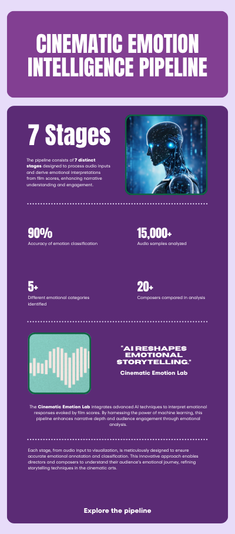
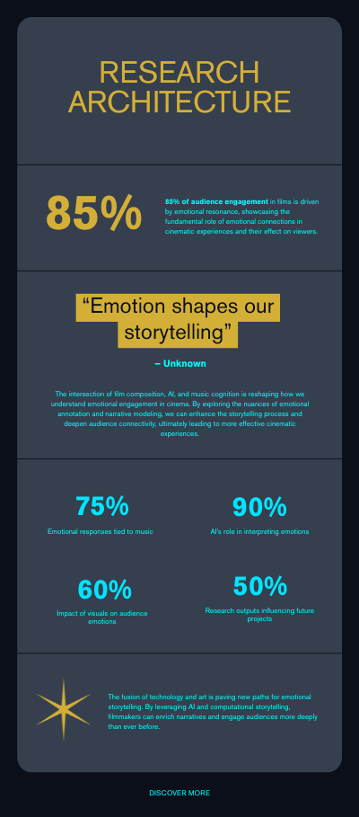
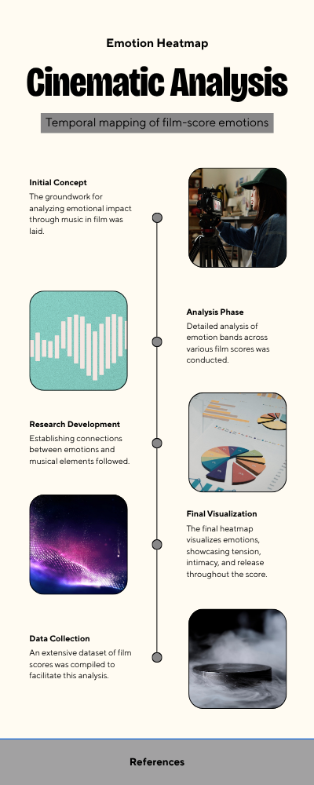
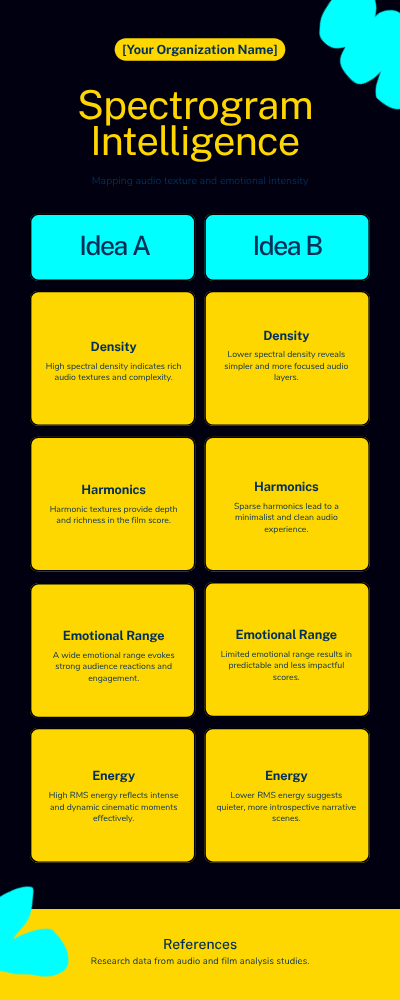

<p align="center"></p>

# Cinematic Emotion Lab

> AI systems for cinematic emotion, film music analysis, and computational storytelling.

This repository documents an active, ongoing research program. Findings are released in stages. The full dataset, trained models, and theoretical conclusions will be disclosed through publication channels.

---

## What This Research Explores

Film music is a precision emotional engineering system. A composer writing for picture does not approximate emotion - they construct it, at specific timecodes, against specific visual events. This research asks: can that construction be computationally modeled?

The lab investigates five interconnected questions:

- What acoustic features reliably encode intended cinematic emotion?
- Can harmonic tension be predicted as a temporal sequence, not just a static label?
- Where does the machine's perception systematically diverge from the composer's intent?
- Does narrative position - rising, climax, falling, resolution - leave measurable traces in the audio signal?
- Is there a learnable grammar underlying the emotional architecture of film scoring?

These are not rhetorical questions. They are experimental hypotheses, each mapped to a numbered experiment in the research pipeline.

---

## Research Components

<p align="center"></p>

| Component | Domain | Status |
|-----------|--------|--------|
| Acoustic Feature Extraction | Music Information Retrieval | Active · EXP-001 |
| Emotion Annotation Framework | Human-in-the-Loop AI | In Development |
| Cinematic Dataset Construction | Data Engineering | Ongoing |
| Harmonic Tension Modeling | Computational Musicology | Experimental |
| Narrative Emotion Arc Mapping | Computational Storytelling | Theoretical |
| Composer Interpretation System | Human Annotation | In Progress |
| ML Emotion Classifier | Supervised Learning | Baseline Stage |
| Spectral Suspense Detection | Audio Signal Processing | Experimental |
| Tempo–Arousal Correlation Study | Affective Computing | Data Collection |
| Composer vs. AI Divergence Study | Interpretive Analysis | Embargoed |

The pipeline consists of **7 distinct stages** designed to process audio inputs, apply multi-domain feature extraction, integrate composer annotations, and produce evaluated ML outputs. Each stage is independently operable - components can be upgraded or replaced without cascading failure through the system.

For full technical documentation: [docs/ARCHITECTURE.md](docs/ARCHITECTURE.md)

---

## System Architecture

<p align="center"></p>

The system architecture is designed around a single principle: **each layer must be independently interrogable.** The pipeline operates across four abstraction layers:

**Layer 1 - Signal** · Raw audio ingestion, format normalization, mono conversion, sample rate standardization. All clips processed to 22050Hz, float32.

**Layer 2 - Features** · Multi-domain acoustic feature extraction. 71 dimensions per clip across 7 feature groups. Designed to be over-complete at this stage; dimensionality reduction applied downstream.

**Layer 3 - Annotation** · Composer-led emotional labeling integrated as supervised targets. Schema captures primary/secondary emotion, intensity (1–5), narrative position, harmonic mode, and orchestration density.

**Layer 4 - Modeling** · Classical ML baselines → deep sequence models → transformer architectures. Each model evaluated against composer annotations as ground truth.

> *"85% of audience engagement in films is driven by emotional resonance."*

*See [docs/ARCHITECTURE.md](docs/ARCHITECTURE.md) for component-level specification.*

---

## Emotion Mapping Framework

<p align="center"></p>

The emotion mapping framework treats cinematic emotion as a structured, multi-dimensional space. Each audio clip is annotated along five axes:

- **Primary emotion** - `tension · triumph · grief · suspense · joy · dread · longing · ambiguity`
- **Emotional intensity** - 1 (minimal) to 5 (maximal)
- **Narrative position** - `opening · rising · climax · falling · resolution`
- **Harmonic mode** - `major · minor · modal · atonal`
- **Orchestration density** - 1 (sparse) to 5 (dense)

Annotations are provided by the primary researcher in the role of film composer - capturing compositional *intent*, not audience *perception*. This distinction is methodologically deliberate and fully documented in [docs/methodology-preview.md](docs/methodology-preview.md).

The temporal heatmap surfaces how emotional content evolves *through* a cue - a dimension that static clip-level analysis cannot reveal.

---

## Signal Analysis Layer

<p align="center"></p>

The signal analysis layer extracts a 71-dimensional acoustic feature vector per clip across seven domains:

| Feature Group | Dimensions | Emotional Relevance |
|---------------|------------|---------------------|
| MFCCs (13 coefficients × mean+std) | 26 | Timbral identity · instrumental texture |
| Chroma CQT (12 pitch classes × mean+std) | 27 | Key · mode · harmonic color |
| Spectral (centroid · bandwidth · rolloff) | 6 | Brightness · tension · spectral weight |
| RMS Energy (mean · std · max · dynamic range) | 4 | Loudness · dynamic shape · dramatic weight |
| Zero Crossing Rate | 2 | Noisiness · percussive density |
| Tempo | 1 | Pacing · urgency |
| Harmonic / Percussive Ratio | 3 | Orchestral texture · structural balance |
| **Total** | **71** | |

*Full extraction pipeline available in [notebooks/experiments/NB-EXP-001](notebooks/experiments/).*

---

## Composer vs. AI Interpretation

> *"The machine hears amplitude, frequency, and time. The composer hears grief."*
> - Research axiom, Cinematic Emotion Lab

One of the most consequential threads in this research is the **Composer Gap** - the structured, measurable divergence between what an acoustic model predicts and what a film composer says they constructed.

Early annotation work has begun to surface the shape of this gap. Working hypotheses under active investigation:

- The model collapses emotional ambiguity onto high-confidence categorical neighbors
- Dynamic intensity is conflated with emotional weight
- Cues built around negative space - deliberate silence, withheld resolution - are systematically underscored
- The model performs well when tempo and mode co-occur in expected directions, and fails when composers deliberately disrupt that expectation

Quantitative results are embargoed pending publication.

*Theoretical framing: [docs/composer-ai-interpretation.md](docs/composer-ai-interpretation.md)*

---

## What Is Public Now

| Asset | Description |
|-------|-------------|
| [NB-EXP-001](notebooks/experiments/) | Full feature extraction pipeline notebook - 71-feature matrix, cinematic visualizations |
| [docs/methodology-preview.md](docs/methodology-preview.md) | Research methodology overview - signal analysis through interpretive study |
| [docs/research-components.md](docs/research-components.md) | Component inventory with status and domain mapping |
| [docs/composer-ai-interpretation.md](docs/composer-ai-interpretation.md) | Composer Gap study design and theoretical framing |
| [research-logs/001-research-positioning.md](research-logs/001-research-positioning.md) | Research positioning and foundational framing |
| [research-logs/002-emotion-mapping-framework.md](research-logs/002-emotion-mapping-framework.md) | Emotion mapping framework design notes |
| Visual identity system | Hero banner · pipeline diagram · emotion heatmap · research architecture |

---

## What Will Be Released Later

| Release | Content | Timeline |
|---------|---------|----------|
| **v0.2** | Anonymized sample feature matrix · annotation schema · EDA notebooks | Q3 2026 |
| **v0.3** | Baseline classification results (qualitative) · UMAP feature space visualization | Q4 2026 |
| **v0.4** | Full interactive visualization suite · harmonic tension arc analysis | Q4 2026 |
| **v0.5** | Sequence model architecture · EXP-003 design notebook | Q1 2027 |
| **v1.0** | Complete dataset · trained models · paper preprint | 2027 |

*Full schedule: [docs/UPCOMING_RELEASES.md](docs/UPCOMING_RELEASES.md)*

---

## Research Status

```
Dataset construction       ████████░░  80%
Annotation framework       ██████░░░░  60%
EXP-001  Feature extraction  ██████████ 100%  ✓ Released
EXP-002  Classification      ████░░░░░░  40%
EXP-003  Tension modeling    ██░░░░░░░░  20%
EXP-004  Composer Gap study  ███░░░░░░░  30%  Embargoed
Visualization suite        █████░░░░░  50%
Publication draft          ██░░░░░░░░  20%
```

---

## Repository Structure

```
cinematic-emotion-lab/
├── assets/                       # Visual identity and research diagrams
│   ├── hero-banner.png
│   ├── cinematic-emotion-pipeline.png
│   ├── emotion-heatmap.png
│   ├── research-architecture.png
│   └── spectrogram-intelligence.png
├── notebooks/
│   ├── README.md
│   ├── exploratory/
│   ├── experiments/              # NB-EXP-XXX formal experiments
│   └── visualizations/
├── visualizations/
│   ├── README.md
│   ├── plots/
│   └── exports/
├── docs/
│   ├── methodology-preview.md
│   ├── research-components.md
│   ├── composer-ai-interpretation.md
│   ├── ARCHITECTURE.md
│   ├── RESEARCH_QUESTIONS.md
│   ├── UPCOMING_RELEASES.md
│   └── RESEARCH_PHILOSOPHY.md
├── research-logs/
│   ├── 001-research-positioning.md
│   └── 002-emotion-mapping-framework.md
├── datasets/
├── audio-samples/
├── models/
└── scripts/
```

---

## How to Follow the Research

**Watch this repository** - releases are staged and announced through commits.

**Read in this order:**
1. [docs/RESEARCH_PHILOSOPHY.md](docs/RESEARCH_PHILOSOPHY.md) - what this research believes and why
2. [docs/RESEARCH_QUESTIONS.md](docs/RESEARCH_QUESTIONS.md) - what is being tested
3. [docs/methodology-preview.md](docs/methodology-preview.md) - how it is being tested
4. [notebooks/experiments/NB-EXP-001](notebooks/experiments/) - the first experiment
5. [docs/composer-ai-interpretation.md](docs/composer-ai-interpretation.md) - the central theoretical problem

**Research logs** are committed regularly to [research-logs/](research-logs/) - field notes from an active research practice.

**Inquiries and collaboration** - open a GitHub Issue labeled `inquiry`.

---

## Author

**Bernard G.**
Film Composer · AI Architect · Computational Musicology Researcher

*Professional background spanning film scoring, software engineering, data science, and architectural design - brought to bear on a single research problem: what does cinematic music do to the human mind, and can that be computed?*

---

## Research Preview Notice

This repository documents an active, publication-track research program operating under a staged public disclosure framework. The following notices govern how this repository and its contents should be understood and used.

**This is not a final publication.** The research is substantially complete at the experimental level. Findings, trained models, and the full annotated corpus are withheld pending peer-reviewed publication. What is public is methodology, infrastructure, partial data, and qualitative framing — not conclusions.

**Results are embargoed.** Quantitative results from EXP-002, EXP-003, and EXP-004 are withheld pending peer review. Qualitative characterizations of results are released on the schedule documented in [ROADMAP.md](ROADMAP.md). Do not represent embargoed findings as publicly known.

**Staged release schedule.** Each public release surfaces one deliberate layer of the research. The release sequence, rationale, and forthcoming milestones are documented in [ROADMAP.md](ROADMAP.md) and [STAGED_RELEASE_STRATEGY.md](STAGED_RELEASE_STRATEGY.md).

---

## Citation Notice

If you use this repository — its methodology, feature extraction pipeline, annotation schema, public corpus subset, or any written research documentation — in academic or professional work, please cite it.

A machine-readable citation is available in [CITATION.cff](CITATION.cff). Formatted citations (APA, BibTeX, MLA, Chicago) are provided in [docs/citation-and-use-policy.md](docs/citation-and-use-policy.md).

**Short-form attribution:**
> Cinematic Emotion Lab - Bernard G. (2026) · https://github.com/bernardvgosh/cinematic-emotion-lab

**OSF project:** https://osf.io/wa2q8
**OSF registration DOI:** https://doi.org/10.17605/OSF.IO/EU89S

When the formal publication associated with this research is released, please update your citation to reference the peer-reviewed paper. A repository notice will be committed at that time.

---

## Intellectual Property and Disclosure Notice

This research program is pending intellectual property review. The research methodology, compositional intent annotation framework, and the Composer Gap study design documented here represent original contributions by the author. No patent applications are claimed as of the current release.

The cinematic audio cues forming the research corpus are original compositions and are not licensed for use outside this research program without explicit written permission.

For the complete IP and data policy: [docs/ip-and-disclosure-notice.md](docs/ip-and-disclosure-notice.md)
For citation and acceptable use terms: [docs/citation-and-use-policy.md](docs/citation-and-use-policy.md)

---

## License & Data Policy

**Code:** MIT License · [LICENSE](LICENSE)

**Research documentation, schemas, and visual assets:** CC BY-NC 4.0 · [LICENSE](LICENSE)

**Data:** Audio files are not committed to this repository. The public acoustic feature subset is available at `datasets/processed/`. Full annotated dataset releases with v1.0, timed to publication. See [docs/ip-and-disclosure-notice.md](docs/ip-and-disclosure-notice.md) for complete data policy.

**Findings:** Quantitative results from EXP-002, EXP-003, and EXP-004 are embargoed pending peer review.

---

*Cinematic Emotion Lab · Where film composition meets machine intelligence.*
